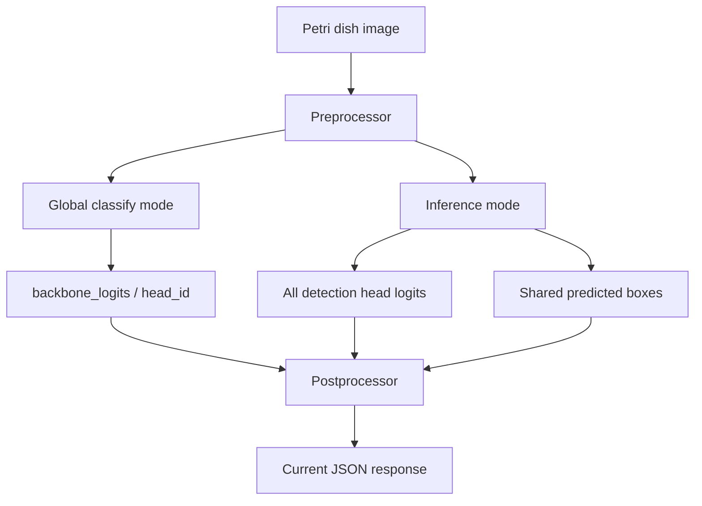
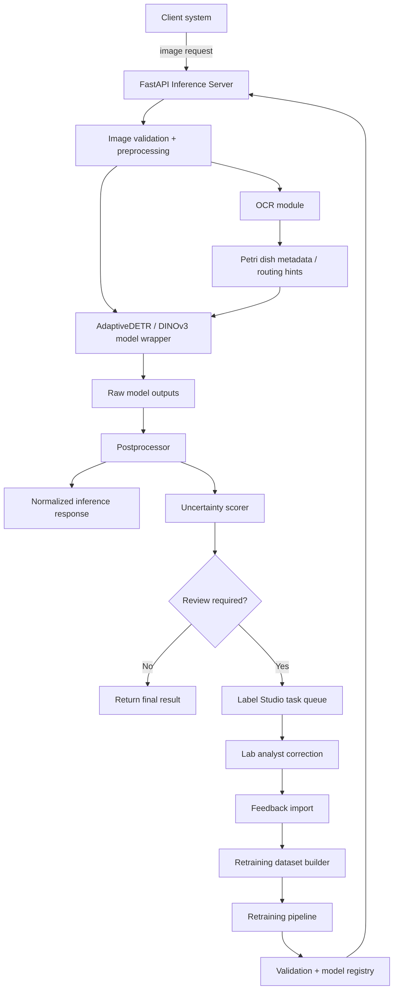

# 02 — System Architecture Specification

## 1. Current Architecture Interpretation

The supplied architecture describes an AdaptiveDETR-style model with:

- A DINOv3/backbone feature extractor.
- A global backbone/domain classifier.
- Multiple domain-specific detection heads.
- A shared bounding box prediction head.
- A postprocessor that selects/interprets outputs using the predicted domain/head.

## 2. Current Head Structure

| Head | Output Shape | Meaning |
|---|---:|---|
| ALL | 256 -> 2 | 1 class + background |
| EC | 256 -> 3 | 2 classes + background |
| YM | 256 -> 3 | 2 classes + background |
| XSA | 256 -> 3 | 2 classes + background |
| ETB | 256 -> 2 | 1 class + background |
| LS | 256 -> 2 | 1 class + background |
| LM | 256 -> 4 | 3 classes + background |
| BC | 256 -> 2 | 1 class + background |

The shared box head predicts boxes in normalized `[x_center, y_center, width, height]` format.

## 3. Current Runtime Flow

## 4. Target Phase 2–4 Architecture

## 5. Important Design Decisions

### Keep Full-Image Context

The client wants to move away from multiple crops because crops can remove context and slow down inference. The target architecture should preserve full Petri dish image inference where possible.

### Support OCR-Guided Expert Routing

The OCR system can detect written text and identify the Petri dish type. This should be used as a routing signal for:

- Selecting the most relevant head.
- Reducing unnecessary downstream computation.
- Supporting a future Mixture-of-Experts approach.

### Avoid Traditional Heavy Ensembles

The client does not want 3–5 full models running in parallel because this increases memory and latency. The target uncertainty design should favor:

- Single-model calibrated uncertainty.
- Feature diversity.
- OCR-guided expert selection.
- Lightweight disagreement methods only when practical.

### Preserve Existing JSON Compatibility

The inference service should preserve the current response format as much as possible, but also add optional fields for uncertainty and review routing.
