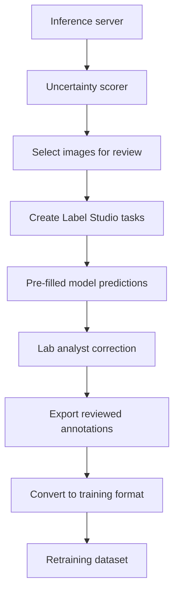

# 06 — Label Studio Workflow

## 1. Goal

Use Label Studio as the on-prem human-in-the-loop review interface.

The client’s lab analysts should review only selected uncertain samples, not the entire image archive.

## 2. Proposed Flow

## 3. Label Studio Task Contents

Each review task should include:

- Full Petri dish image.
- Model-predicted bounding boxes.
- Model-predicted class/head.
- Confidence score.
- Uncertainty reason.
- OCR-derived E-code/L-code when available.
- Model version.

## 4. Analyst Actions

The analyst should be able to:

- Accept a prediction.
- Correct a class label.
- Move/resize bounding box.
- Delete false positives.
- Add missed colonies.
- Mark image as unusable.
- Add comments for edge cases.

## 5. Export Format

Label Studio output should be converted into the internal training format.

The conversion script should preserve:

- `image_id`
- original model prediction
- corrected label
- corrected box
- correction type
- annotator ID
- timestamp
- model version
- active learning reason

## 6. Suggested Review Queue Categories

| Queue | Purpose |
|---|---|
| High uncertainty | Model confidence is low. |
| Rare class | Class has low representation. |
| OCR/model conflict | OCR dish type and predicted head disagree. |
| Density challenge | Very dense colony images. |
| Validation audit | Random sample for quality control. |

## 7. Phase 1 Output

Phase 1 delivers the Label Studio workflow design and task schema. Actual Label Studio integration scripts are Phase 3 work.
