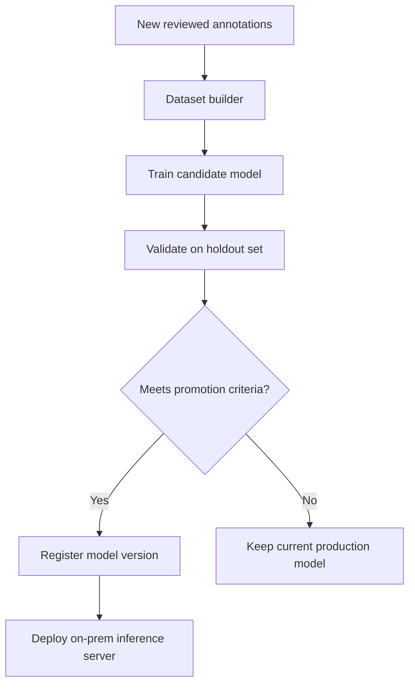

# 07 — Training and Retraining Strategy

## 1. Goal

Improve the current model while minimizing manual annotation.

The system should support continuous learning from analyst feedback.

## 2. Initial Evaluation

Before changing the model, run a baseline evaluation:

- Per-head precision.
- Per-head recall.
- Per-head F1.
- Bounding box mAP / IoU.
- Count accuracy.
- Calibration error.
- Latency.
- Failure modes by Petri dish type.

## 3. Model Improvement Options

### Option A — Keep DINOv3/AdaptiveDETR and Improve Training

This is the lowest-risk path.

Possible improvements:

- Better calibration.
- Better loss weighting for rare heads/classes.
- Improved query count tuning.
- Better data augmentation.
- Head-specific threshold tuning.
- Hard negative mining.
- Active learning feedback loop.

### Option B — Add OCR-Guided Mixture of Experts

Use OCR to route the image to the relevant expert/head.

Benefits:

- Lower unnecessary compute.
- Better head specialization.
- Lower memory impact than full ensembles.

### Option C — Evaluate Alternative Detector Head

If benchmarks justify it, compare the current AdaptiveDETR design against an improved DETR-style head.

This should be done as a controlled experiment, not as a blind replacement.

## 4. Retraining Loop

## 5. Promotion Criteria

A new model version should be promoted only if:

- Overall F1 improves or stays stable.
- No critical head/class regresses beyond agreed tolerance.
- Count accuracy improves or stays stable.
- Calibration does not get worse.
- Latency remains within acceptable range.
- False negatives for important classes do not increase.

## 6. Human Labels vs Pseudo-Labels

Human labels and pseudo-labels should be stored separately.

Recommended weighting:

- Human labels: full weight.
- Pseudo-labels: lower weight or filtered only.
- Unverified pseudo-labels: never overwrite human annotations.

## 7. Model Versioning

Each model version should track:

- Training dataset version.
- Annotation batch IDs.
- Code commit or package version.
- Hyperparameters.
- Validation metrics.
- Calibration metrics.
- Deployment timestamp.
- Rollback path.

## 8. Phase 1 Output

Phase 1 delivers the retraining strategy and promotion rules. Actual training scripts and pipeline automation are Phase 2/3 work.
